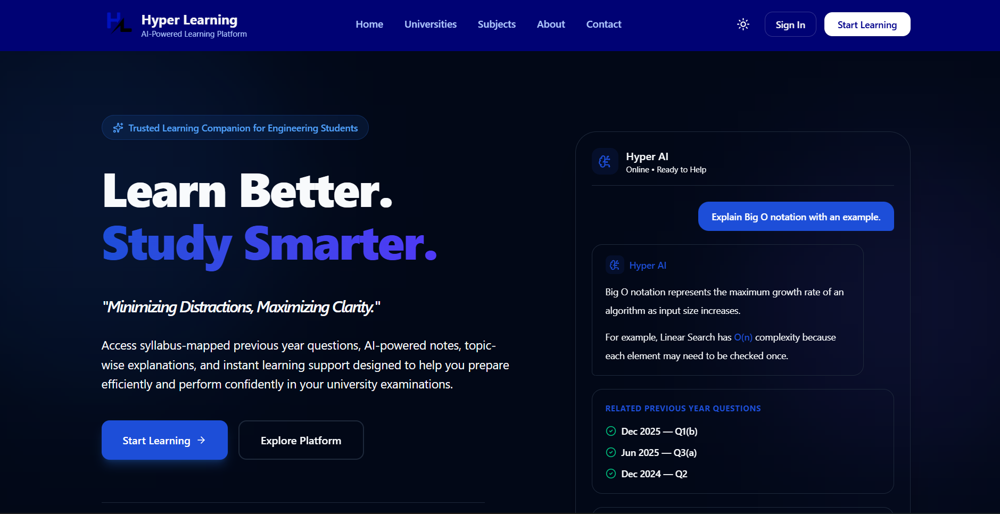

<div align="center">



# Hyper Learning Tech

**AI-powered academic learning platform for engineering students**

[](LICENSE)
[](https://nextjs.org)
[](https://www.typescriptlang.org)
[](https://tailwindcss.com)
[](https://vercel.com)
[](https://ai.google.dev)

[**Live Platform →**](https://www.hyperlearningtech.in) · [Report a Bug](https://github.com/imuniqueshiv/HyperLearningTech/issues) · [Request a Feature](https://github.com/imuniqueshiv/HyperLearningTech/issues)

</div>

---

## What Is Hyper Learning Tech?

Hyper Learning Tech bridges the gap between static academic resources and intelligent learning experiences. Instead of handing students a pile of PDFs and past papers, it connects **syllabus → notes → previous year questions → AI tutoring** into a single cohesive workflow.

Built specifically for **RGPV engineering students**, it covers:

- Semester-wise previous year question papers (PYQs) with branch and subject filtering
- AI-generated topic-level notes on demand, cached for instant reuse
- Structured answers for 2-mark, 5-mark, and 10-mark examination questions
- An AI tutor that retains session context for follow-up questions
- Student productivity tools: bookmarks, progress tracking, and a personalized dashboard
- A role-gated admin system for editors and platform owners

---

## Features

<details>
<summary><strong>📚 Academic Content Management</strong></summary>

- Subject-wise syllabus organization
- Unit-wise topic breakdown
- Topic-specific AI-generated notes (Gemini, cached in PostgreSQL)
- Version-controlled content updates
- Related PYQ mapping per topic

</details>

<details>
<summary><strong>📝 Previous Year Questions (PYQs)</strong></summary>

- Semester-wise and branch-wise paper collection
- Subject-wise filtering and question-to-unit mapping
- Fast retrieval backed by Redis caching

</details>

<details>
<summary><strong>🤖 AI-Powered Learning</strong></summary>

**AI Answer Generation** — structured answers for 2, 5, 10-mark, and long-answer exam questions, with Redis caching so repeat requests are instant.

**AI Learning Notes** — on-demand notes for individual topics, units, or entire subjects, persisted to PostgreSQL after first generation.

**AI Tutor** — a conversational interface with Redis-backed session context so students can ask follow-up questions, request examples, and simplify difficult concepts without losing thread.

</details>

<details>
<summary><strong>🔖 Student Productivity</strong></summary>

- Bookmarks and saved content
- Learning progress tracking
- Recently viewed topics
- Personalized dashboard

</details>

<details>
<summary><strong>👨‍💼 Administration System</strong></summary>

| Role        | Capabilities                                                                |
| ----------- | --------------------------------------------------------------------------- |
| **Student** | Learn, bookmark, track progress, use AI tutor                               |
| **Editor**  | Upload papers, edit content, generate notes, manage resources               |
| **Owner**   | Manage editors, approve applications, review audit logs, configure platform |

- Invitation-only editor accounts
- Owner approval workflow
- Full audit logging with login notifications

</details>

<details>
<summary><strong>🔍 Search</strong></summary>

Full-text search across subjects, units, topics, notes, and PYQs in a single query.

</details>

---

## Tech Stack

| Layer              | Technology                                |
| ------------------ | ----------------------------------------- |
| **Framework**      | Next.js 16 (App Router)                   |
| **Language**       | TypeScript 5.9                            |
| **Styling**        | Tailwind CSS v4, ShadCN/UI, Framer Motion |
| **Auth**           | Clerk (RBAC, MFA, protected routes)       |
| **Database**       | PostgreSQL via Neon, Prisma ORM 7         |
| **Cache**          | Redis via Upstash                         |
| **AI**             | Google Gemini (`@google/genai`)           |
| **Email**          | Resend                                    |
| **Storage**        | Cloudinary                                |
| **Monitoring**     | Sentry                                    |
| **Analytics**      | PostHog                                   |
| **Deployment**     | Vercel                                    |
| **Math Rendering** | KaTeX + react-katex                       |
| **PDF Export**     | html2pdf.js                               |

---

## Architecture

```
Browser (Student / Editor / Owner)
            │
            ▼
    Next.js 16 (App Router)
    Server Components + API Routes
            │
     ┌──────┼──────────┐
     │      │          │
     ▼      ▼          ▼
PostgreSQL  Redis    Google
  (Neon)  (Upstash)  Gemini
     │      │
     ▼      ▼
  Topics  AI Answers
  Notes   Chat Sessions
  PYQs    Rate Limits
  Users   Context Cache
```

### AI Workflow: PYQ Answer Generation

```
Student submits question
        │
        ▼
   Redis Lookup
        │
   ┌────┴────┐
Cache Hit  Cache Miss
   │           │
   ▼           ▼
Return       Gemini API
Answer           │
             Save to Redis
                 │
             Return Answer
```

### AI Workflow: Topic Note Generation

```
Student opens topic
        │
        ▼
  PostgreSQL Lookup
        │
   ┌────┴────┐
  Exists   Missing
   │           │
   ▼           ▼
Return       Gemini API
  Note           │
             Save to PostgreSQL
                 │
             Return Note
```

---

## Project Structure

```
HyperLearningTech/
├── app/                  # Next.js App Router pages and API routes
├── components/           # Shared UI components
├── features/
│   └── landing/          # Landing page feature module
├── content/
│   └── rgpv/             # RGPV syllabus and paper content
├── data/                 # Static data and seed files
├── hooks/                # Custom React hooks
├── lib/                  # Prisma client, Redis client, Gemini client, utilities
├── prisma/               # Schema and migrations
├── public/               # Static assets
├── types/                # Global TypeScript types
├── constants/            # App-wide constants
├── .github/              # Issue templates and CI workflows
├── proxy.ts              # Edge middleware / route protection
├── next.config.ts
└── package.json
```

---

## Getting Started

### Prerequisites

- Node.js 20+
- PostgreSQL database (Neon recommended)
- Upstash Redis instance
- Clerk account
- Google AI API key (Gemini)

### Installation

```bash
# 1. Clone the repository
git clone https://github.com/imuniqueshiv/HyperLearningTech.git
cd HyperLearningTech

# 2. Install dependencies
npm install

# 3. Set up environment variables
cp .env.example .env
# Fill in all values in .env (see section below)

# 4. Set up the database
npx prisma migrate dev

# 5. Start the development server
npm run dev
```

Open [http://localhost:3000](http://localhost:3000).

---

## Environment Variables

Copy `.env.example` to `.env` and fill in the following:

```env
# ── Database ──────────────────────────────────────────
DATABASE_URL=

# ── Upstash Redis ─────────────────────────────────────
UPSTASH_REDIS_REST_URL=
UPSTASH_REDIS_REST_TOKEN=

# ── Google Gemini ─────────────────────────────────────
GEMINI_KEY_1=
GEMINI_WORKSPACE_KEY_1=

# ── Clerk Authentication ──────────────────────────────
NEXT_PUBLIC_CLERK_PUBLISHABLE_KEY=
CLERK_SECRET_KEY=

# ── Email (Resend) ────────────────────────────────────
RESEND_API_KEY=

# ── Analytics (PostHog) ───────────────────────────────
NEXT_PUBLIC_POSTHOG_KEY=
NEXT_PUBLIC_POSTHOG_HOST=

# ── Error Monitoring (Sentry) ─────────────────────────
NEXT_PUBLIC_SENTRY_DSN=
SENTRY_AUTH_TOKEN=
```

> **Note:** The platform currently supports up to 4 Gemini API keys for load distribution. Add them as `GEMINI_KEY_2`, `GEMINI_KEY_3`, etc.

---

## Available Scripts

```bash
npm run dev          # Start development server
npm run build        # Production build
npm run start        # Start production server
npm run typecheck    # TypeScript type checking
npm run lint         # ESLint
npm run format       # Prettier (write)
npm run format:check # Prettier (check only)
```

---

## Roadmap

| Phase       | Focus                                                                           | Status         |
| ----------- | ------------------------------------------------------------------------------- | -------------- |
| **Phase 1** | Next.js migration, PostgreSQL, Prisma, Clerk auth                               | ✅ Complete    |
| **Phase 2** | Topic-based learning, AI note generation, versioning, search                    | 🔄 In Progress |
| **Phase 3** | AI Tutor, progress tracking, bookmarks, personalized dashboard                  | 🔜 Planned     |
| **Phase 4** | Admin dashboard, paper upload pipeline, OCR, content moderation                 | 🔜 Planned     |
| **Phase 5** | Advanced analytics, recommendation engine, multi-university support, mobile app | 🔜 Planned     |

See [CHANGELOG.md](CHANGELOG.md) for detailed release notes.

---

## Contributing

Contributions are welcome. Please read [CONTRIBUTING.md](CONTRIBUTING.md) before opening a pull request.

- 🖼️ [Question Attachments Guide](docs/QUESTION_ATTACHMENTS_GUIDE.md) — Standards for adding educational figures, diagrams, graphs, tables, and other question attachments.

# Quick contribution workflow
git fork https://github.com/imuniqueshiv/HyperLearningTech
git checkout -b feat/your-feature-name
git commit -m "feat: describe your change"
git push origin feat/your-feature-name
# Open a Pull Request on GitHub
```

Areas where contributions are especially valuable: UI/UX improvements, accessibility, performance optimization, documentation, and test coverage.

Please also review our [Code of Conduct](CODE_OF_CONDUCT.md) and [Security Policy](SECURITY.md).

---

## License

This project is licensed under the **Apache License 2.0**. See the [LICENSE](LICENSE) file for full details.

---

## Maintainers

<table>
  <tr>
    <td align="center">
      <strong>Shiv Raj Singh</strong><br/>
      Founder &amp; Lead Full Stack Developer<br/>
      <a href="https://www.linkedin.com/in/shiv-raj-singh-387973299/">LinkedIn</a> ·
      <a href="https://github.com/imuniqueshiv">GitHub</a>
    </td>
    <td align="center">
      <strong>Nitin Pandey</strong><br/>
      UI/UX Designer<br/>
      <a href="https://www.linkedin.com/in/nitin-mohan-9251ab328/">LinkedIn</a> ·
      <a href="https://github.com/nitinmohan18">GitHub</a>
    </td>
    <td align="center">
      <strong>Ramoo Kachhee</strong><br/>
      Frontend Developer<br/>
      <a href="https://www.linkedin.com/in/ramoo-kachhee-9b1616405/">LinkedIn</a> ·
      <a href="https://github.com/RamuuXfree">GitHub</a>
    </td>
  </tr>
</table>

---

<div align="center">

**[www.hyperlearningtech.in](https://www.hyperlearningtech.in)**

If this project helps you, please ⭐ star the repository — it helps others find it.

</div>
